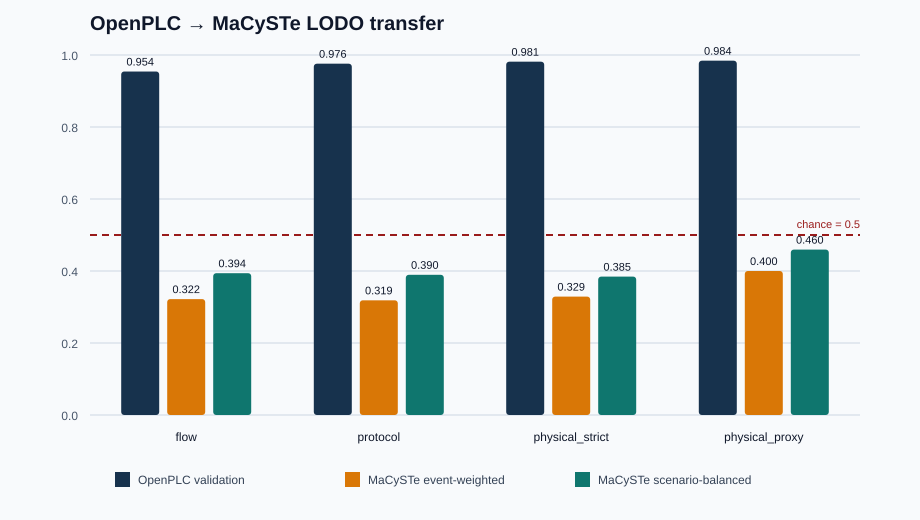

# When a Lab-Accurate Industrial IDS Meets a New Testbed

## A reproducible OpenPLC → MaCySTe maritime OT case study

> **Release state:** public R1 release approved; GitHub publication pending
>
> **Headline result:** a model scoring **0.95–0.98 AUC** on OpenPLC fell to
> **0.32–0.46 AUC** on held-out MaCySTe data. A threshold selected for a 1%
> false-positive rate produced approximately **26–50%** on the new testbed.

That is not a small accuracy drop. In this case study, a detector that looked
strong in its source laboratory could create an operationally unusable alarm
load—and parts of its target-domain ranking were inverted.

This repository lets researchers and maritime-OT practitioners verify the
result from distributed data and frozen analysis code. It also tests a product
hypothesis: dependable vessel monitoring may require deployment-specific
discovery, semantic mapping, local calibration, explicit degraded-state
reporting, and change-triggered revalidation instead of trusting a static
model trained elsewhere.

The repository is a deliberately narrow research slice of Maritime-Lab. The
private GÖZCÜ EDGE product source, customer delivery methods, and production
security configuration are not included.

## Sixty-second result

| Feature schema | OpenPLC validation AUC | MaCySTe event AUC | MaCySTe scenario-balanced AUC |
|---|---:|---:|---:|
| `flow` | 0.9543 | 0.3220 | 0.3940 |
| `protocol` | 0.9759 | 0.3186 | 0.3895 |
| `physical_strict` | 0.9813 | 0.3289 | 0.3845 |
| `physical_proxy` | 0.9842 | 0.4001 | 0.4595 |

The threshold was selected only on OpenPLC for a target false-positive rate of
1%. On the held-out MaCySTe campaign, the observed false-positive rate rises to
approximately 26–50%, depending on the feature schema. AUC values below 0.5
mean that the target-domain ranking is not merely weaker; it can be inverted.



The result is bounded to one transfer direction, one OpenPLC–MaCySTe testbed
pair, one 200-tree Random Forest model family, and the included attack/fault
implementations. It is not evidence about all industrial IDSs, cross-vendor
performance, or real-vessel operation. `physical_proxy` is the least degraded
schema in this case study, but that is a secondary hypothesis-generating
observation—not evidence that process-aware features generally transfer.

## What can be tested

The package has four reproducibility levels:

| Level | Meaning | Current state |
|---|---|---|
| R0 | Verify every distributed file and frozen result by SHA-256 | Available |
| R1 | Re-run tests and the complete analysis from the 12 derived MaCySTe event files | Available |
| R2 | Re-create derived events from the exact raw PCAP/EVE campaign | Pending external immutable data archive/DOI |
| R3 | Independent party repeats the method on another testbed or capture | Not yet completed |

R1 is the minimum useful GitHub research artifact: a fresh clone can recompute
the headline result without access to the private product repository. R2 should
be delivered through Zenodo or another immutable research-data archive rather
than placing the approximately 200 MiB raw campaign in Git history.

## Quick verification

```bash
python scripts/verify_artifact.py
```

This verifies `artifact-manifest.json`, rejects unexpected product/sensitive
paths, and checks all distributed bytes.

## Full derived-data reproduction

Create an isolated environment, install the pinned research dependencies, then
run:

```bash
python -m pip install -r requirements.txt
python scripts/reproduce_openplc_macyste.py
```

The command:

1. runs the 153 academic contract tests;
2. verifies the OpenPLC dataset snapshot;
3. validates the 12 MaCySTe derived files and their frozen manifest;
4. rebuilds the exact 34,949-row combined target table;
5. recomputes LODO, unseen-category, stratification, and score-discreteness
   results;
6. compares all five new JSON outputs with the frozen results after normalizing
   only the host-specific absolute path of the temporary combined CSV.

The executable analysis modules and their contract tests are exported from the
exact `v0.5.0-academic-freeze` Git tag, not from the evolving product working
tree. The tag and commit are recorded in `artifact-manifest.json`; the original
full runtime dependency file and freeze entrypoint are retained under
`provenance/`. The release-specific test dependency is security-maintained in
the root `requirements.txt` rather than copying the historical development pin.

Use `--skip-tests` only for a faster local rerun after a full verified run.

## Scientific contribution

The artifact tests a narrower and more defensible question than “does ML work
for maritime cybersecurity?”:

> How does an IDS trained and calibrated in one maritime OT testbed behave
> under a held-out testbed with different protocol encodings and operational
> distributions, and which observable mechanisms explain transfer failure?

The contribution is the combination of:

- a leakage-resistant cross-testbed protocol;
- source-only threshold selection;
- event-weighted and scenario-balanced reporting;
- explicit unseen-category mass diagnostics;
- score-support/threshold plateau diagnostics;
- machine-verifiable provenance and result boundaries.

## Product-learning boundary

The artifact can test an important product hypothesis without being the
product itself: if static models do not transfer safely between testbeds, a
commercial observer may need vessel-specific discovery, semantic mapping,
calibration, degraded-state reporting, and evidence-backed change management.

Evidence that would strengthen this hypothesis:

- independent R1 reproductions;
- the same experiment using IPAL/SIMPLE/GeCo baselines;
- a second independent target testbed or reverse-direction transfer;
- a qualified integrator or owner confirming that calibration and evidence
  gaps are a purchasing problem;
- later, authorized simulator/VDR/field validation.

Repository stars alone are not product validation. Useful signals are external
reproductions, citations, dataset reuse, integration pull requests, qualified
industry conversations, and a paid design-partner path.

## We are looking for collaborators

This release is meant to start useful conversations, not merely collect stars.
We would especially like to hear from:

- researchers who can independently reproduce R1 or challenge the method;
- laboratories that can support a second authorized testbed or reverse-transfer
  experiment;
- maritime faculties, simulator operators, integrators, yards, owners, and
  cyber teams that can test whether calibration and evidence gaps are real
  operational problems;
- technical mentors, research sponsors, and design partners who can help move
  the work from a bounded laboratory result toward authorized simulator, VDR,
  or field validation.

Open a GitHub issue for a public reproduction or collaboration question, or
contact **info@nauticmall.com** for a private introduction. Do not send vessel
data, credentials, private captures, or sensitive topology through a public
issue.

## Deliberately excluded

This artifact must not contain:

- `edge_agent`, `edge_console`, `edge_forwarder`, or production deployment
  source;
- production PKI, IAM, firewall, trust-root, update, or support configuration;
- executable attack campaign clients or evasion material;
- customer, vessel, topology, pricing, or field-delivery records;
- raw security scan/remediation reports;
- real-vessel or restricted validation data;
- private keys, credentials, runtime logs, PCAP/PCAPNG, or debrief material.

## Release readiness

The owner confirmed project-code and generated-data publication authority on
15 August 2026. On 17 August 2026, the owner decided not to pursue a patent
application for this RC1 research artifact and approved public release because
the GÖZCÜ product sources remain outside the package.

Identity, ownership, licensing/provenance, privacy and secret review,
dependency audit, malware scan, clean release history, R0 hash verification,
and R1 derived-data reproduction checks are complete. R2 raw-campaign DOI
archiving and R3 independent replication remain future reproducibility levels;
they are not claims or blockers for this R1 release.

## Licenses and provenance

Maritime-Lab software included in the candidate currently follows the root MIT
license. The OpenPLC-derived research dataset and the project-owned MaCySTe
experimental observations are declared CC BY 4.0 in the dataset card.

The MaCySTe-derived data distribution review was completed on 14 August 2026.
AGPL-3.0 section 2 states that output from running a covered work is covered
only when the output's content constitutes a covered work. The 12 distributed
`events-v0.4.csv` files contain generated protocol/process observations,
project labels, and project-computed fields; they contain no MaCySTe source
code. The publication decision is therefore to distribute those observations
under CC BY 4.0 with explicit MaCySTe attribution. This decision does not
relicense MaCySTe source code. Upstream attribution, license, and README are
preserved in `THIRD_PARTY_LICENSES/`.
