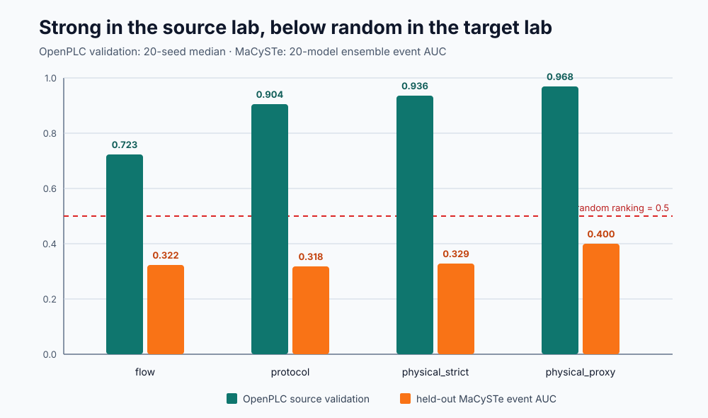

# A Strong Lab Result Can Still Fail in the Next Lab

## A preregistered OpenPLC → MaCySTe maritime OT transfer case study

> **RC2 candidate — not public yet.** The repository and release remain private
> while the corrected package is independently checked.
>
> **Main result:** protocol and process-aware models reached median source
> validation AUCs of **0.90–0.97**, yet their held-out MaCySTe ensemble event
> AUCs were only **0.32–0.40**.

Can an industrial intrusion detector that looks convincing in one laboratory
be trusted in another? In this bounded experiment, no. The ranking degraded
below random for every tested schema on the held-out target campaign.

This release is designed to attract the most useful kind of attention:
independent attempts to reproduce, challenge, or extend the result. It includes
the data required for derived-data reanalysis, a result-blind preregistration,
20 fixed seeds, run-level splitting, machine-verifiable hashes, and an explicit
record of what the experiment does **not** establish.

The package is a research slice, not a product release. GÖZCÜ EDGE source,
customer delivery material, production security configuration, and executable
attack clients are excluded.

## The result in sixty seconds

| Feature schema | Source validation AUC, median [min, max] | MaCySTe event AUC, 20-model ensemble | Scenario-balanced AUC |
|---|---:|---:|---:|
| `flow` | 0.723 [0.645, 0.764] | 0.322 | 0.394 |
| `protocol` | 0.904 [0.822, 0.932] | 0.318 | 0.389 |
| `physical_strict` | 0.936 [0.850, 0.953] | 0.329 | 0.385 |
| `physical_proxy` | 0.968 [0.923, 0.981] | 0.400 | 0.454 |



The source value summarizes 20 run-level train/validation splits. The target
point estimate uses the arithmetic mean of all 20 model scores for each event.
Its scenario-stratified run-bootstrap interval uses that same score and metric,
fixing the point/interval mismatch identified in RC1.

Because MaCySTe has only three closely scripted repetitions per scenario, those
intervals describe sensitivity to these 12 runs. They are not population or
cross-testbed generalization confidence intervals.

## What RC2 corrected

RC1 is retained only as a private draft and must not be published as the main
result. RC2 corrects four material problems:

1. The main OpenPLC model now uses only `flow/modbus` and `normal/attack` rows.
2. Any run containing a `fault` event is excluded in full from training and
   threshold selection, preventing fault-context leakage.
3. All 20 preregistered seeds (`42–61`) are reported; no favorable seed is
   selected.
4. Target point estimates and sensitivity intervals use the same ensemble
   score and the same metric.

The full contract was committed before recomputation and is available in
[`PREREGISTRATION.md`](PREREGISTRATION.md) and
[`preregistration.json`](preregistration.json).

## A separate benign-fault stress test

Eight independent OpenPLC runs (`19, 20, 23–28`) contain 3,337 fault events in
24 run×scenario cells. They were never used for model fitting, feature choice,
or threshold selection.

At thresholds selected only on source validation normals, the median
cell-balanced false-positive rate was 0 for `flow`, `protocol`, and
`physical_strict`, and 0.000568 (about 0.057%) for `physical_proxy`.

This is encouraging but deliberately **descriptive**. Eight laboratory runs do
not estimate field reliability, product performance, or a population false-
alarm rate. MaCySTe threshold-dependent false-positive and recall values are
also descriptive and are not a headline result because each scenario has only
three near-scripted repeats.

## Help us falsify or extend it

The highest-value contributions are not stars. We are looking for:

- an independent R1 reproduction on a clean machine;
- a second authorized testbed or a reverse MaCySTe → OpenPLC experiment;
- comparisons with IPAL, SIMPLE, GeCo, or another defensible baseline;
- a laboratory willing to run varied, independently initialized campaigns;
- maritime faculty, simulator operators, integrators, yards, owners, and cyber
  teams who can test whether calibration and evidence gaps are operationally
  important;
- technical mentors, research sponsors, or design partners who can support an
  authorized simulator, VDR, or later field-validation path.

Open a GitHub issue for a public reproduction or methodological challenge.
For a private introduction, email **info@nauticmall.com**. Do not send vessel
data, credentials, restricted captures, or sensitive topology through a public
issue.

## Reproducibility levels

| Level | Meaning | RC2 state |
|---|---|---|
| R0 | Verify every distributed byte and result by SHA-256 | Available |
| R1 | Re-run the preregistered analysis from distributed derived events | Available |
| R2 | Re-create derived events from an immutable raw archive | Not claimed; DOI archive pending |
| R3 | Independent external replication | Not claimed; collaborators wanted |

### Fast integrity check

```bash
python scripts/verify_artifact.py
```

### Full R1 reanalysis

```bash
python -m pip install -r requirements.txt
python scripts/reproduce_openplc_macyste_rc2.py
```

The full run verifies the preregistration and input hashes, checks all 20
run-level splits, trains 80 models, recomputes the 2,000-repeat scripted-run
sensitivity analysis, and requires exact semantic equality with the frozen
result JSON.

## Scientific boundary

This package supports one narrow statement:

> For the included OpenPLC → MaCySTe direction, data generation, feature
> schemas, and 200-tree Random Forest family, source-laboratory ranking did not
> transfer reliably to the held-out target campaign.

It does not establish that:

- all industrial or maritime IDS models fail to transfer;
- the result applies to a real vessel or another testbed;
- GÖZCÜ EDGE is validated or superior;
- the descriptive fault or threshold metrics are population estimates;
- the diagnostic mechanisms prove causality;
- IMO, IACS, class, flag, or customer acceptance requirements are satisfied.

## Deliberately excluded

The artifact rejects product source, production PKI/IAM/firewall/update
configuration, attack campaign clients, customer or vessel records, raw PCAP,
private keys, credentials, runtime logs, private security reports, and
restricted validation material.

## Licenses and provenance

Included Maritime-Lab research code follows the MIT license. Project-generated
research observations are distributed under CC BY 4.0 as documented in the
dataset and provenance records.

The distributed MaCySTe-derived CSV files contain experimental observations,
project labels, and project-computed fields—not MaCySTe source code. Upstream
attribution, license, and README are preserved under `THIRD_PARTY_LICENSES/`.
No affiliation with or endorsement by the MaCySTe authors is claimed.
